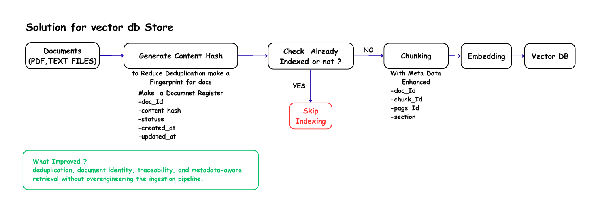

# RAG-UP Re-Engineered Agentic University RAG System (LangGraph)

**From Traditional RAG → Agentic RAG**

An agentic Retrieval-Augmented Generation system that answers university questions with **planning, tools, semantic caching, and measured performance**  not a single retrieve-then-generate pipeline.

New Optimizations:
solution 1 - optimized vector store 


> Predecessor: [HelpDesk RAG Chatbot](https://github.com/omalmaleesha/HelpDesk-RAG-Chatbot)

[](https://www.python.org/)
[](https://github.com/langchain-ai/langgraph)
[](https://fastapi.tiangolo.com/)
[](https://groq.com/)
[](https://www.trychroma.com/)

---

## Table of contents

1. [Project overview](#project-overview)
2. [Problem statement](#problem-statement)
3. [Solution](#solution)
4. [Key features](#key-features)
5. [Architecture](#architecture)
6. [How it works](#how-it-works)
7. [Tech stack](#tech-stack)
8. [Key engineering decisions](#key-engineering-decisions)
9. [Performance and metrics](#performance-and-metrics)
10. [Challenges and solutions](#challenges-and-solutions)
11. [Project structure](#project-structure)
12. [API and usage examples](#api-and-usage-examples)
13. [Installation and setup](#installation-and-setup)
14. [Testing and evaluation](#testing-and-evaluation)
15. [Security and production considerations](#security-and-production-considerations)
16. [Results and impact](#results-and-impact)
17. [Future improvements](#future-improvements)
18. [Demo](#demo)
19. [Author and links](#author-and-links)

---

## Project overview

RAG-UP is a **decision-driven AI agent** for university help-desk style questions (admissions, fees, policies, campus facts, academic calendar).

A traditional RAG chatbot treated every question the same: retrieve documents, send them to an LLM, generate an answer. That works, but it wastes retrieval, tokens, and latency on questions the system has already answered  and it has no way to choose a specialized tool (for example, calendar lookup vs. document search).

RAG-UP rebuilds that pipeline as a **LangGraph state machine**. The graph decides when to reuse a cached answer, when to skip tools, which tool to call, and when to persist a new Q&A pair. The agent is exposed as a **FastAPI** service and a **CLI**, with per-request timing and LLM-call counts.

**Design principle:** do not use an LLM for everything. Use an LLM where it adds value, and use software engineering for routing, caching, validation, and measurement.

---

## Problem statement

University help desks repeat the same factual questions at high volume. A naive RAG stack has three practical problems:

1. **Unnecessary LLM cost** — similar questions still hit the model every time.
2. **Unnecessary retrieval** — greetings, rephrasing, and already-answered queries still query the vector store.
3. **One-size-fits-all routing** — dates and schedules are mixed into the same PDF retrieval path as policy text, which is slower and less precise.

The original HelpDesk RAG chatbot followed:

```
User question → Retrieval → Context → LLM → Answer
```

That flow is easy to build and expensive to run at scale and can't run in production

---

## Solution

RAG-UP inserts an **orchestration layer** in front of generation:

| Decision | Mechanism |
| --- | --- |
| Have we answered this before? | Semantic cache (Chroma + embeddings), skip the rest of the graph on hit |
| Do we even need tools? | Rule-based post-cache router for greetings / generative asks |
| Which knowledge source? | LLM planner with structured output: `rag` \| `calendar` \| `none` |
| Is the answer worth storing? | Lightweight reflection (grounding / “not found” heuristic) then cache write |
| Did it get faster? | Node-level timers, LLM call counts, written performance reports |

The system still uses RAG for university documents (PDF → chunk → Chroma). It adds **tools, cache, and routing** so repeated work is skipped.

---

## Key features

- **LangGraph agent workflow** — stateful graph with conditional edges (cache hit/miss, planner, tools, generate, reflect, write cache).
- **Semantic cache** — similar questions return stored answers without a new LLM call (distance threshold on embedding search).
- **Planner with structured output** — Pydantic schema so the LLM returns `enough_information` and `selected_tool` instead of free-form JSON.
- **Tool routing** — RAG retriever (Chroma, top-k = 5) and calendar lookup (JSON events + RapidFuzz).
- **Cheap rule-based shortcut** — after a cache miss, greetings and purely generative prompts can skip the planner/tools path.
- **Grounded generation** — answers are constrained to retrieved context / tool results; missing facts return a fixed fallback line.
- **FastAPI chat API** — `POST /chat` with strict Pydantic validation (length, strip, extra fields forbidden).
- **CLI + API together** — `main.py` starts Uvicorn in a background thread and an interactive CLI.
- **Instrumentation** — per-node seconds, total time, LLM calls, cache hit flag; reports appended to `metrics/test_metrics.txt` (optional PDF export).
- **50-query benchmark harness** — 25 unique questions twice (cache miss vs cache hit) against the live API.

---

## Architecture

High-level component interaction:

[Architecture diagram (Google Drive)](https://drive.google.com/file/d/1ygrwyNLfEe8DEXNxah683_hUkgDuhNTH/view?usp=sharing)

**Main components**

| Layer | Role |
| --- | --- |
| `api/` | HTTP surface, request validation |
| `ragAiAgent.py` | Graph compile, `process_query`, metrics hook |
| `nodes/` | One responsibility per node |
| `tools/` | RAG retrieve-only; calendar fuzzy match |
| `services/` | LLM, embeddings, Chroma vector store, semantic cache, calendar JSON |
| `metrics/` | Reports and PDF export |
| `test/` | Live API benchmark |

---

## How it works

1. **Ingest (offline)** — `load_data.py` loads `data/example.pdf`, splits with `RecursiveCharacterTextSplitter` (chunk size 300, overlap 50), resets the vector collection, and inserts chunks into Chroma (`VECTOR_DB`).
2. **Query enters** — CLI or `POST /chat` calls `RagAiGraph.process_query`.
3. **Conversation memory** — previous messages are joined into a string for later use (summary memory is a planned upgrade).
4. **Semantic cache lookup** — embed the query, nearest-neighbor search in `SEMANTIC_CACHE_DB`. If distance ≤ 0.5, return the cached answer and **stop** (no planner, no tools, no LLM).
5. **Route after miss** — keyword / length heuristics: greetings and “write a poem” style prompts go **direct_generate**; factual / lookup language goes **plan_tools**.
6. **Planner** — Groq model with structured output chooses `rag`, `calendar`, or `none`. If documents or tool results already exist, it marks `enough_information=true` so the graph does not loop tools forever.
7. **Tool router** — executes exactly one selected tool: Chroma similarity search or RapidFuzz over `data/calendar.json`. Then returns to the planner.
8. **Generate** — LLM answers using only retrieved chunks (truncated) and/or tool results. Increments `llm_calls`. Prints token usage when Groq provides `usage_metadata`.
9. **Reflection** — currently a fast heuristic (score drop if the model said it could not find the information). Always proceeds to cache write in the current graph.
10. **Cache writer** — stores question text + answer metadata in the semantic cache for the next similar query.
11. **Respond** — API returns `answer`, `total_time`, `llm_calls`, `cache_hit`. Reporter prints and appends a full report.

---

## Tech stack

| Area | Choice |
| --- | --- |
| Language | Python 3.13+ |
| Agent orchestration | LangGraph (`StateGraph`, conditional edges) |
| LLM / RAG building blocks | LangChain, LangChain-Groq, LangChain-Chroma, LangChain-HuggingFace |
| LLM inference | Groq (`ChatGroq`, model from `MODEL_NAME`, e.g. `openai/gpt-oss-20b`) |
| Embeddings | Sentence Transformers via HuggingFace (`all-MiniLM-L6-v2`) |
| Vector store + cache | ChromaDB (two persist directories) |
| API | FastAPI + Uvicorn, Pydantic v2 |
| PDF ingest | pypdf / LangChain `PyPDFLoader` |
| Calendar matching | RapidFuzz |
| Config | python-dotenv |
| Packaging | uv (`pyproject.toml` / `uv.lock`) |
| Reports | reportlab (TXT → PDF) |

---

## Key engineering decisions

**LangGraph instead of a linear chain**  
Nodes are independently timed and swapped. Cache hit is a first-class edge to `END`, which a linear `RetrievalQA` chain cannot express cleanly.

**Semantic cache (embeddings) instead of exact string match**  
Users rephrase the same admissions question. Exact cache would miss; vector distance reuses the answer.

**Structured planner output**  
`enough_information` and `selected_tool` are typed (`Literal["rag", "calendar", "none"]`). That avoids brittle regex on model text and keeps the graph deterministic.

**Rule-based router before the planner**  
Greetings should not pay for a planner LLM call. Heuristics are cheap; the planner is reserved for tool choice.

**Retrieve-only RAG tool**  
The retriever never generates. Generation is a separate node with an explicit “use only this context” prompt. Easier to debug hallucinations and to measure RAG vs. calendar paths.

**Groq for inference**  
Interactive CLI/API needs low latency. Groq’s fast open-model inference was chosen over slower default cloud chat APIs for development and demos.

**Separate Chroma collections**  
Knowledge (`VECTOR_DB`) and Q&A cache (`SEMANTIC_CACHE_DB`) stay isolated so resetting the corpus does not wipe cached answers (and vice versa).

**Measure, then optimize**  
Every node records wall time. The 50-query harness exists so cache claims are numbers, not anecdotes.

---

## Performance and metrics

Logged runs in `metrics/test_metrics.txt` (100 reports in the current file: mixed interactive + benchmark traffic):

| Metric | Observed |
| --- | --- |
| Cache hits | 58 / 100 reports |
| Cache misses | 42 / 100 reports |
| Average cache-hit total time | **~0.027 s** (range ~0.012–0.098 s) |
| Average cache-miss total time | **~6.48 s** (range ~2.0–15.0 s) |
| Approximate hit vs miss speedup | **~240×** on cached queries |
| LLM calls on hits | **0** (by design) |

**Designed benchmark** (`test/test.py`): 25 unique university questions, then the same 25 again.

| Phase | Expected behavior |
| --- | --- |
| Cache miss | RAG / planner / LLM / cache write |
| Cache hit | Cached answer, **0 LLM calls** |
| LLM calls avoided | Up to 25 on the second pass |

Typical **cold** path from node timers (example miss): semantic cache ~0.05–0.1 s, planner ~0.4–0.6 s, generate ~0.6–0.7 s+, cache write ~0.03–0.04 s. **Hot** path is essentially embedding search + return.

Reports include timestamp, query, cache flag, selected tool, LLM calls, per-node times, retrieved doc count, and the response text. Convert TXT → PDF with:

```bash
python -c "from metrics.performance_reporter import PerformanceReporter; PerformanceReporter().txt_to_pdf()"
```

---

## Challenges and solutions

| Challenge | What we did |
| --- | --- |
| Repeat questions still cost a full RAG+LLM pass | Semantic cache with a distance threshold; graph short-circuits on hit |
| Planner looping or calling tools with no schema | Structured `PlannerOutput`; once docs/tool results exist, force `enough_information` |
| Extra LLM latency for “hi” / thanks | Rule-based `route_after_cache` after miss |
| Calendar buried in PDF retrieval | Dedicated calendar tool + fuzzy title match |
| Cannot prove the cache helps | Per-node metrics + 25×2 API benchmark + append-only reports |
| Reflection LLM would double cost | Replaced model-as-judge with a cheap “not found” heuristic (full LLM reflection can be re-enabled) |
| Secrets in source | API key and paths loaded from `.env`, not committed as application code |

---

## Project structure

```
my-rag-up/
├── api/                    # FastAPI app and ChatRequest schema
├── nodes/                  # Graph nodes (memory, cache, planner, generate, …)
├── tools/                  # rag_tool, calendar_tool
├── services/               # LLM, embeddings, Chroma, cache, calendar
├── data/                   # example.pdf, calendar.json
├── database/               # persisted Chroma dirs (local)
├── metrics/                # performance_reporter, test_metrics.txt
├── test/                   # live API 50-query benchmark
├── ragAiAgent.py           # state, graph, process_query
├── main.py                 # wire services, CLI + API
├── load_data.py            # PDF ingest into vector DB
├── pyproject.toml          # uv dependencies
└── README.md
```

---

## API and usage examples

### Interactive CLI + API

```bash
uv run python main.py
```

Type questions at `RAG UP CLI:` (or `exit` / `quit`). The API listens on `http://127.0.0.1:8000`.

Swagger UI: [http://localhost:8000/docs](http://localhost:8000/docs)

### REST

```http
GET /
```

```json
{ "message": "Hello from FastAPI and uv!" }
```

```http
POST /chat
Content-Type: application/json

{ "query": "What is the minimum GPA requirement for undergraduate admission?" }
```

```json
{
  "answer": "...",
  "total_time": 2.17,
  "llm_calls": 1,
  "cache_hit": false
}
```

```bash
curl -s -X POST http://127.0.0.1:8000/chat ^
  -H "Content-Type: application/json" ^
  -d "{\"query\": \"In what year was Apex Horizon University founded?\"}"
```

(On Unix, use `\` line continuations instead of `^`.)

`query` is required: 1–2000 characters, trimmed, extra JSON fields rejected.

---

## Installation and setup

**Requirements:** Python 3.13+, [uv](https://github.com/astral-sh/uv), a Groq API key.

```bash
git clone https://github.com/omalmaleesha/RAG-UP.git
cd RAG-UP
uv sync
```

Create a `.env` file in the project root (do not commit real keys):

```env
GROQ_API_KEY=your_groq_api_key
MODEL_NAME=openai/gpt-oss-20b
EMBEDDING_MODEL=sentence-transformers/all-MiniLM-L6-v2
VECTOR_DB=./database/vector_db
SEMANTIC_CACHE_DB=./database/semantic_cache
```

Load (or reload) the university PDF into Chroma:

```bash
uv run python load_data.py
```

Run the agent (CLI + API):

```bash
uv run python main.py
```

API-only (agent must still be initialized the way `main.py` does via `set_agent`; prefer `main.py` for a working `/chat`):

```bash
uv run python main.py
```

---

## Testing and evaluation

**Approach:** black-box evaluation against the running API, not mocked LLM unit tests.

| Item | Detail |
| --- | --- |
| Harness | `test/test.py` |
| Corpus | 25 factual questions about the sample university PDF |
| Protocol | Phase 1 cache miss (5 s gap for rate limits) → Phase 2 same questions (1 s gap) |
| Checks | HTTP 200, `cache_hit`, `llm_calls`, latency, answer snippet |
| Artifact | `metrics/test_metrics.txt` |

```bash
# Terminal 1
uv run python main.py

# Terminal 2
uv run python test/test.py
```

The script refuses to run if `GET /` is down. It prints a summary: cache-hit rate, LLM calls avoided, average miss vs hit latency, speedup.

**Coverage today:** end-to-end latency and cache correctness. There is no automated assertion suite for answer exact-match accuracy yet (see Future improvements).

---

## Security and production considerations

**In place**

- Secrets via environment variables (`GROQ_API_KEY`).
- Request validation: max length, non-empty after strip, `extra="forbid"`, `strict=True`.
- Generation constrained to retrieved/tool context (reduces open-ended prompt injection into “knowledge”).
- FastAPI error responses when the agent is not initialized.

**Not production-ready yet (honest gaps)**

- No authentication / rate limiting on `/chat`.
- No user isolation; semantic cache is global.
- CORS, HTTPS, and process management (beyond a local Uvicorn thread) are not configured.
- Calendar file and vector DB are local filesystem — no multi-tenant access control.
- Reflection does not currently reject answers from being cached.
- Logging is stdout-oriented; no structured log sink or PII redaction.

For a real deployment: add auth, per-user or namespaced cache, rate limits, health/readiness probes, and a process manager (or container) instead of a daemon thread next to a CLI.

---

## Results and impact

Compared with the original linear HelpDesk RAG bot, this project shows:

- **Repeat questions** can be served in tens of milliseconds with **zero LLM calls**.
- **First-time questions** still use RAG + Groq, typically on the order of a few seconds depending on planner + generation.
- **Tool split** (documents vs calendar) is an explicit graph decision, not a prompt hope.
- **Engineering discipline** — typed planner I/O, validated API, and a repeatable 50-query experiment — so optimizations are measurable.

That is the career story: take a working RAG demo, find the cost/latency bottleneck, and rebuild it as an agent with cache and routing.

---

## Future improvements

- Re-enable **LLM reflection** with a retry edge back to the planner when the answer fails grounding checks.
- **ConversationSummaryMemory** instead of concatenating raw messages.
- Document ingest **UI** (upload PDF / detect file type) instead of a one-off `load_data.py`.
- Streaming responses on FastAPI.
- Auth, rate limits, and namespaced caches for multi-user use.
- Automated **answer accuracy** scoring against a gold set (exact / F1 / LLM-as-judge with a held-out model).
- Hybrid retrieval (keyword + vector) and better chunking for long policy PDFs.
- Replace global in-process agent with a proper app lifespan / dependency injection.

---

## Demo

| Surface | How to see it |
| --- | --- |
| Interactive CLI | `uv run python main.py` then ask campus/admissions questions twice — second time should show `Cache Hit : True` |
| Swagger | [http://localhost:8000/docs](http://localhost:8000/docs) → try `POST /chat` |
| Metrics | Watch terminal `PERFORMANCE` blocks; open `metrics/test_metrics.txt` |
| Architecture visual | [Drive diagram](https://drive.google.com/file/d/1ygrwyNLfEe8DEXNxah683_hUkgDuhNTH/view?usp=sharing) |

Screenshots, GIFs, or a hosted demo URL can be added here when available.

---

## Author and links

**Omal Maleesha (Maleesha Jayamanne)** — software engineer focused on backend systems, RAG, and agentic workflows.

- GitHub: [github.com/omalmaleesha](https://github.com/omalmaleesha)
- This repo: [github.com/omalmaleesha/RAG-UP](https://github.com/omalmaleesha/RAG-UP)
- Previous RAG system: [HelpDesk RAG Chatbot](https://github.com/omalmaleesha/HelpDesk-RAG-Chatbot)
- LinkedIn: [linkedin.com/in/omal-maleesha-5a5171311](https://www.linkedin.com/in/omal-maleesha-5a5171311)

---

## License

This project is open for learning and extension. Add a formal license file if you need a specific SPDX term for employers or forks.
